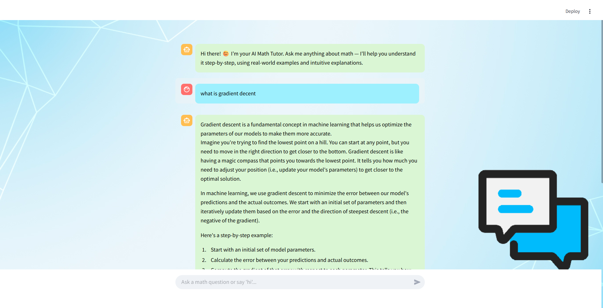

# 📐 AI Math Tutor ChatBot with Ollama

This project is a **friendly, interactive AI-powered math tutor** built with [Streamlit](https://streamlit.io/) and [Ollama](https://ollama.ai/), offering step-by-step explanations and real-world examples to help users understand math concepts easily.

 <!-- Replace with an actual screenshot link if deployed -->

---

## Features

- **Background image support** for a visually appealing interface.
- **Conversational AI Tutor** that answers math-related queries step-by-step.
- **Persistent chat memory** for contextual responses.
- **Friendly tone and intuitive explanations** to support all types of learners.


---


## 🛠️ Requirements

Install the following Python packages:

```bash
pip install streamlit ollama
```

---

## ▶️ How to Run

1. Make sure you have [Ollama](https://ollama.ai/) installed and running locally.
2. Run the app:

```bash
streamlit run app.py
```

---

## 🧠 Note

This tutor is optimized for math learning queries only

---


